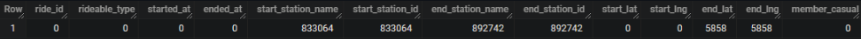
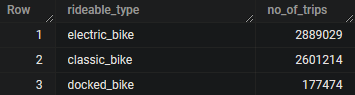
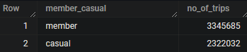
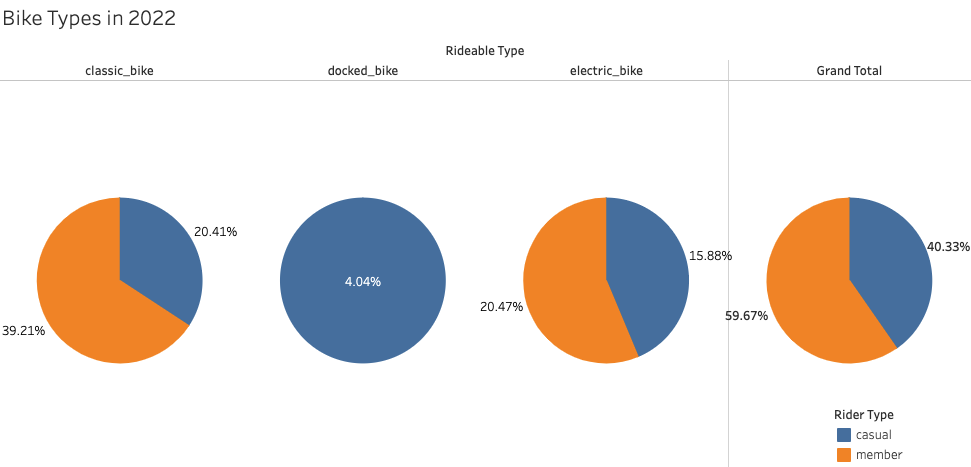
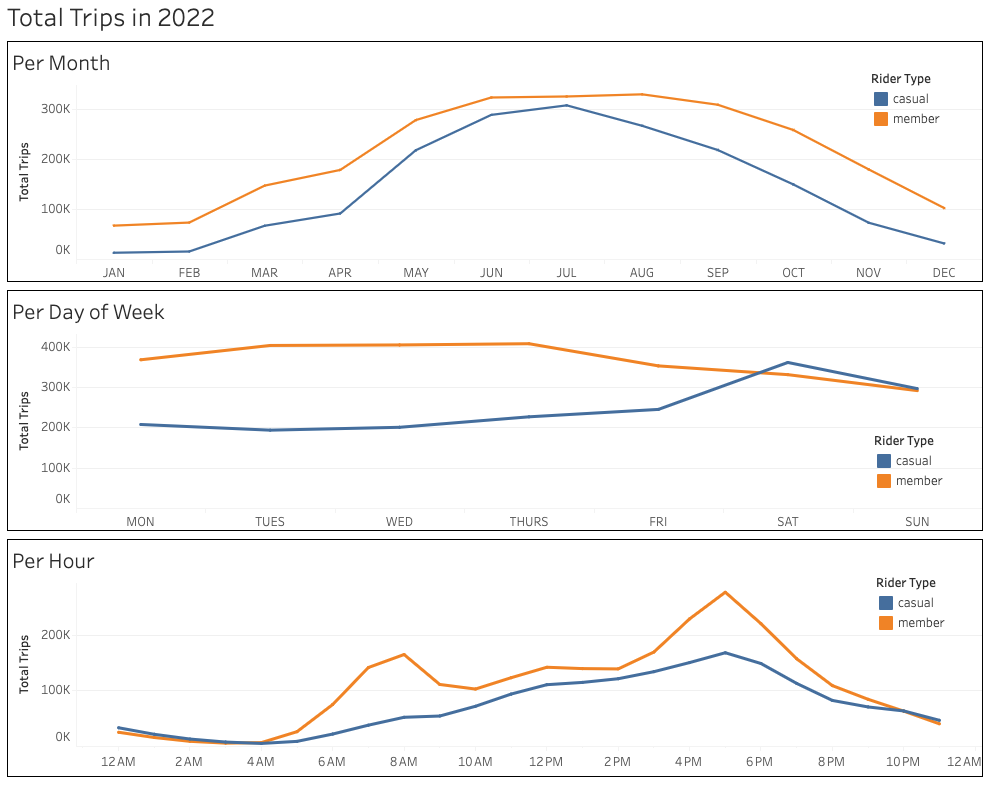
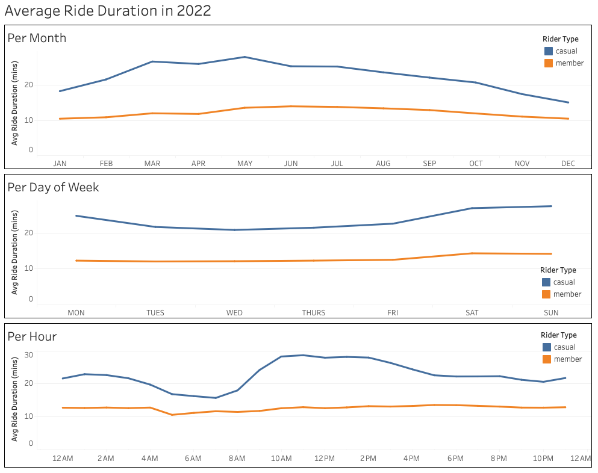
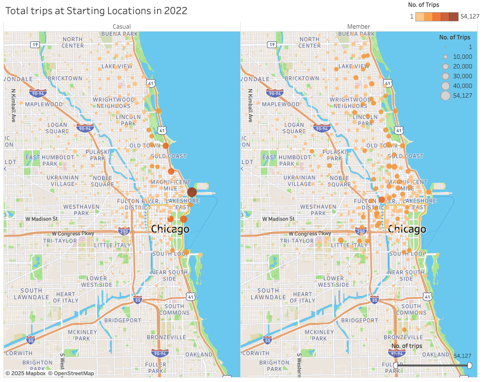
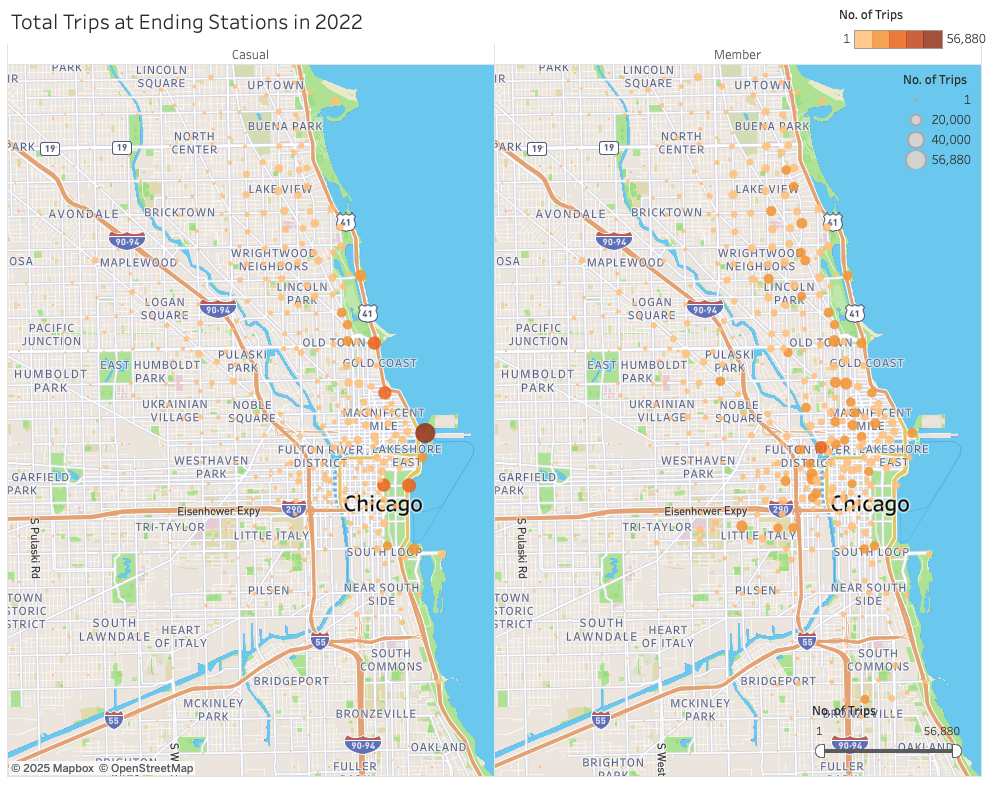

# Bike Share Program Case Study
**[Google Data Analytics Capstone](https://www.coursera.org/learn/google-data-analytics-capstone)**

Tool(s): SQL, Tableau

## Introduction
In this case study, I performed many real-world tasks of a data analyst at a fictional company, Cyclistic. In order to answer the key business questions, I will follow the steps of the data analysis process: [Ask](#Ask), [Prepare](#Prepare), [Process](#Process), [Analyze](#Analyze-and-Share), [Share](#Analyze-and-Share), and [Act](#Act).

## Background
### Cyclistic
A bike-share program that features more than 5,800 bicycles and 600 docking stations. Cyclistic sets itself apart by also offering reclining bikes, hand tricycles, and cargo bikes, making bike-share more inclusive to people with disabilities and riders who can’t use a standard two-wheeled bike. The majority of riders opt for traditional bikes; about 8% of riders use the assistive options. Cyclistic users are more likely to ride for leisure, but about 30% use them to commute to work each day.   
  
Until now, Cyclistic’s marketing strategy relied on building general awareness and appealing to broad consumer segments. One approach that helped make these things possible was the flexibility of its pricing plans: single-ride passes, full-day passes, and annual memberships. Customers who purchase single-ride or full-day passes are referred to as casual riders. Customers who purchase annual memberships are Cyclistic members.  
  
Cyclistic’s finance analysts have concluded that annual members are much more profitable than casual riders. Although the pricing flexibility helps Cyclistic attract more customers, Moreno (the director of marketing and my manager) believes that maximizing the number of annual members will be key to future growth. Rather than creating a marketing campaign that targets all-new customers, Moreno believes there is a very good chance to convert casual riders into members. She notes that casual riders are already aware of the Cyclistic program and have chosen Cyclistic for their mobility needs.  

Moreno has set a clear goal: Design marketing strategies aimed at converting casual riders into annual members. In order to do that, however, the marketing analyst team needs to better understand how annual members and casual riders differ, why casual riders would buy a membership, and how digital media could affect their marketing tactics. Moreno and her team are interested in analyzing the Cyclistic historical bike trip data to identify trends.  

### Scenario
I am assuming to be a junior data analyst working in the marketing analyst team at Cyclistic, a bike-share company in Chicago. The director of marketing believes the company’s future success depends on maximizing the number of annual memberships. Therefore, my team wants to understand how casual riders and annual members use Cyclistic bikes differently. From these insights, my team will design a new marketing strategy to convert casual riders into annual members. But first, Cyclistic executives must approve our recommendations, so they must be backed up with compelling data insights and professional data visualizations.

## Ask
### Business Task
Devise marketing strategies to convert casual riders to members.
### Analysis Questions
Three questions will guide the future marketing program:  
1. How do annual members and casual riders use Cyclistic bikes differently?  
2. Why would casual riders buy Cyclistic annual memberships?  
3. How can Cyclistic use digital media to influence casual riders to become members?  

Moreno has assigned me the first question to answer: How do annual members and casual riders use Cyclistic bikes differently?

## Prepare
### Data Source
I will use Cyclistic’s historical trip data to analyze and identify trends from Jan 2022 to Dec 2022 which can be downloaded from [divvy_tripdata](https://divvy-tripdata.s3.amazonaws.com/index.html). The data has been made available by Motivate International Inc. under this [license](https://www.divvybikes.com/data-license-agreement). 

This is public data that can be used to explore how different customer types are using Cyclistic bikes. But note that data-privacy issues prohibit from using riders’ personally identifiable information. This means that we won’t be able to connect pass purchases to credit card numbers to determine if casual riders live in the Cyclistic service area or if they have purchased multiple single passes.

### Data Organization
There are 12 files with naming convention of YYYYMM-divvy-tripdata and each file includes information for one month, such as the ride id, bike type, start time, end time, start station, end station, start location, end location, and whether the rider is a member or not. The corresponding column names are ride_id, rideable_type, started_at, ended_at, start_station_name, start_station_id, end_station_name, end_station_id, start_lat, start_lng, end_lat, end_lng and member_casual.

## Process
BigQuery is used to combine the various datasets into one dataset and clean it. Since Cyclistic dataset has more than 5.6 million rows, it is essential to use a platform like BigQuery that supports huge volumes of data.  

### Combining the Data
12 csv files are uploaded as tables in the dataset '2022_tripdata'. Another table named "combined_data" is created, containing 5,667,717 rows of data for the entire year. 
```sql
-- Data Combining

DROP TABLE IF EXISTS `2022_tripdata.combined_data`;

-- combining all the 12 months data tables into a single table containing data from Jan 2022 to Dec 2022.

CREATE TABLE IF NOT EXISTS `2022_tripdata.combined_data` AS (
  SELECT * FROM `2022_tripdata.202201_tripdata`
  UNION ALL
  SELECT * FROM `2022_tripdata.202202_tripdata`
  UNION ALL
  SELECT * FROM `2022_tripdata.202203_tripdata`
  UNION ALL
  SELECT * FROM `2022_tripdata.202204_tripdata`
  UNION ALL
  SELECT * FROM `2022_tripdata.202205_tripdata`
  UNION ALL
  SELECT * FROM `2022_tripdata.202206_tripdata`
  UNION ALL
  SELECT * FROM `2022_tripdata.202207_tripdata`
  UNION ALL
  SELECT * FROM `2022_tripdata.202208_tripdata`
  UNION ALL
  SELECT * FROM `2022_tripdata.202209_tripdata`
  UNION ALL
  SELECT * FROM `2022_tripdata.202210_tripdata`
  UNION ALL
  SELECT * FROM `2022_tripdata.202211_tripdata`
  UNION ALL
  SELECT * FROM `2022_tripdata.202212_tripdata`
);

-- checking no of rows which are 5667717

SELECT COUNT(*)
FROM `2022_tripdata.combined_data`;
```

### Data Exploration
Before cleaning the data, I am familiarizing myself with the data to find the inconsistencies.  

I first checked the data types of all the columns. The __ride_id__ column is our primary key.
```sql
SELECT column_name, data_type
FROM `2022_tripdata`.INFORMATION_SCHEMA.COLUMNS
WHERE table_name = 'combined_data';
```


Next, I wanted to know how many null values were in each columns, if there was any. I noticed that some columns have the same number of missing values. This may be due to missing information in the same row i.e. station's name and id for the same station and latitude and longitude for the same ending station.    
```sql
SELECT COUNT(*) - COUNT(ride_id) ride_id,
 COUNT(*) - COUNT(rideable_type) rideable_type,
 COUNT(*) - COUNT(started_at) started_at,
 COUNT(*) - COUNT(ended_at) ended_at,
 COUNT(*) - COUNT(start_station_name) start_station_name,
 COUNT(*) - COUNT(start_station_id) start_station_id,
 COUNT(*) - COUNT(end_station_name) end_station_name,
 COUNT(*) - COUNT(end_station_id) end_station_id,
 COUNT(*) - COUNT(start_lat) start_lat,
 COUNT(*) - COUNT(start_lng) start_lng,
 COUNT(*) - COUNT(end_lat) end_lat,
 COUNT(*) - COUNT(end_lng) end_lng,
 COUNT(*) - COUNT(member_casual) member_casual
FROM `2022_tripdata.combined_data`;
```


Since ride_id had no null values I used it to check for duplicates. My query confirmed there were no duplicate rows in the data and that all rid-id values had a length of 16. So, no cleaning will be needed. 
```sql 
SELECT COUNT(ride_id) - COUNT(DISTINCT ride_id) AS duplicate_rows
FROM `2022_tripdata.combined_data`;

SELECT LENGTH(ride_id) AS length_ride_id, COUNT(ride_id) AS no_of_rows
FROM `2022_tripdata.combined_data`
GROUP BY length_ride_id;
```
Now, I wanted to know the number of unique types of bikes (__rideable_type__) in our data. My query showed 3. 
```sql 
SELECT DISTINCT rideable_type, COUNT(rideable_type) AS no_of_trips
FROM `2022_tripdata.combined_data`
GROUP BY rideable_type;
```


The __started_at__ and __ended_at__ showed start and end time of the trip in YYYY-MM-DD hh:mm:ss UTC format. So, I created a new column ride_length to find the total trip duration. There were 5360 trips that had durations longer than a day and 122283 trips had durations less than a minute or or end times earlier than the start time. These trips needed to be removed.
```sql
SELECT started_at, ended_at
FROM `2022_tripdata.combined_data`
LIMIT 10;

SELECT COUNT(*) AS longer_than_a_day
FROM `2022_tripdata.combined_data`
WHERE (
  EXTRACT(HOUR FROM (ended_at - started_at)) * 60 +
  EXTRACT(MINUTE FROM (ended_at - started_at)) +
  EXTRACT(SECOND FROM (ended_at - started_at)) / 60) >= 1440; 

SELECT COUNT(*) AS less_than_a_minute
FROM `2022_tripdata.combined_data`
WHERE (
  EXTRACT(HOUR FROM (ended_at - started_at)) * 60 +
  EXTRACT(MINUTE FROM (ended_at - started_at)) +
  EXTRACT(SECOND FROM (ended_at - started_at)) / 60) <= 1;  
```

I next removed rows where either  start/end station name and id were missing. A total of 833064 rows have both __start_station_name__ and __start_station_id__ missing. A total of 892742 rows have both __end_station_name__ and __end_station_id__ missing. 
```sql
-- start_station_name, start_station_id
SELECT DISTINCT start_station_name
FROM `2022_tripdata.combined_data`
ORDER BY start_station_name;

SELECT COUNT(ride_id) AS rows_with_start_station_null          
FROM `2022_tripdata.combined_data`
WHERE start_station_name IS NULL OR start_station_id IS NULL;

-- end_station_name, end_station_id
SELECT DISTINCT end_station_name
FROM `2022_tripdata.combined_data`
ORDER BY end_station_name;

SELECT COUNT(ride_id) AS rows_with_null_end_station         
FROM `2022_tripdata.combined_data`
WHERE end_station_name IS NULL OR end_station_id IS NULL;
```

I also removed rows with missing end latitudes and longitudes. A total of 5858 rows have both __end_lat__ and __end_lng__ missing. 
```sql
SELECT COUNT(ride_id) AS rows_with_null_end_loc
FROM `2022_tripdata.combined_data`
WHERE end_lat IS NULL OR end_lng IS NULL;
```

Lastly, I wanted to know how many unique values the __member_casual__ column had. My query returned 2 - member or casual rider.
```sql
SELECT DISTINCT member_casual, COUNT(member_casual) AS no_of_trips
FROM `2022_tripdata.combined_data`
GROUP BY member_casual;
```


I deteremined that the columns start_station_id and end_station_id could be removed as they do not add value to analysis of my current problem. Longitude and latitude location columns may be used to visualise a map.

### Data Cleaning
1. All the rows having missing values are deleted.  
2. 3 more columns ride_length for duration of the trip, day_of_week and month are added.  
3. Trips with duration less than a minute and longer than a day are excluded.
4. Total 1,375,912 rows are removed in this step.

```sql
DROP TABLE IF EXISTS `2022_tripdata.cleaned_combined_data`;

-- creating new table with clean data

CREATE TABLE IF NOT EXISTS `2022_tripdata.cleaned_combined_data` AS (
  SELECT 
    a.ride_id, rideable_type, started_at, ended_at, 
    ride_length,
    CASE EXTRACT(DAYOFWEEK FROM started_at) 
      WHEN 1 THEN 'SUN'
      WHEN 2 THEN 'MON'
      WHEN 3 THEN 'TUES'
      WHEN 4 THEN 'WED'
      WHEN 5 THEN 'THURS'
      WHEN 6 THEN 'FRI'
      WHEN 7 THEN 'SAT'    
    END AS day_of_week,
    CASE EXTRACT(MONTH FROM started_at)
      WHEN 1 THEN 'JAN'
      WHEN 2 THEN 'FEB'
      WHEN 3 THEN 'MAR'
      WHEN 4 THEN 'APR'
      WHEN 5 THEN 'MAY'
      WHEN 6 THEN 'JUN'
      WHEN 7 THEN 'JUL'
      WHEN 8 THEN 'AUG'
      WHEN 9 THEN 'SEP'
      WHEN 10 THEN 'OCT'
      WHEN 11 THEN 'NOV'
      WHEN 12 THEN 'DEC'
    END AS month,
    start_station_name, end_station_name, 
    start_lat, start_lng, end_lat, end_lng, member_casual
  FROM `2022_tripdata.combined_data` a
  JOIN (
    SELECT ride_id, (
      EXTRACT(HOUR FROM (ended_at - started_at)) * 60 +
      EXTRACT(MINUTE FROM (ended_at - started_at)) +
      EXTRACT(SECOND FROM (ended_at - started_at)) / 60) AS ride_length
    FROM `2022_tripdata.combined_data`
  ) b 
  ON a.ride_id = b.ride_id
  WHERE 
    start_station_name IS NOT NULL AND
    end_station_name IS NOT NULL AND
    end_lat IS NOT NULL AND
    end_lng IS NOT NULL AND
    ride_length > 1 AND ride_length < 1440
);

ALTER TABLE `2022_tripdata.cleaned_combined_data`     -- set ride_id as primary key
ADD PRIMARY KEY(ride_id) NOT ENFORCED;

SELECT COUNT(ride_id) AS no_of_rows       -- returned 4,291,805 rows so 1,375,912 rows removed
FROM `2022_tripdata.cleaned_combined_data`;
```
  
## Analyze and Share
I queried multiple relevant tables to investigate how do annual members and casual riders use Cyclistic bikes differently?  

I first compared how member and casual riders are compared by the type of bikes they are using. 
```sql
-- bikes types used by riders

SELECT member_casual, rideable_type, COUNT(*) AS total_trips
FROM `2022_tripdata.cleaned_combined_data`
GROUP BY member_casual, rideable_type
ORDER BY member_casual, total_trips;
```
The members make 59.7% of the total while remaining 40.3% constitutes casual riders. Each bike type chart shows percentage from the total. Most used bike is classic bike followed by the electric bike. Docked bikes are used the least by only casual riders. 


Next, I looked at the number of trips distributed by the months, days of the week and hours of the day.  
```sql
-- no. of trips per month
SELECT month, member_casual, COUNT(ride_id) AS total_trips
FROM `2022_tripdata.cleaned_combined_data`
GROUP BY month, member_casual
ORDER BY member_casual;

-- no. of trips per day of week
SELECT day_of_week, member_casual, COUNT(ride_id) AS total_trips
FROM `2022_tripdata.cleaned_combined_data`
GROUP BY day_of_week, member_casual
ORDER BY member_casual;

-- no. of trips per hour
SELECT EXTRACT(HOUR FROM started_at) AS hour_of_day, member_casual, COUNT(ride_id) AS total_trips
FROM `2022_tripdata.cleaned_combined_data`
GROUP BY hour_of_day, member_casual
ORDER BY member_casual;
```
When it comes to **monthly** trips, both casual and members exhibit comparable behavior, with more trips in the spring and summer and fewer in the winter. The gap between casuals and members is closest in the month of july in summmer. When the **days of the week** are compared, it is discovered that casual riders make more journeys on the weekends while members show a decline over the weekend in contrast to the other days of the week. For **hours of the day**, the members shows 2 peaks throughout the day in terms of number of trips. One is early in the morning at around 6 am to 8 am and other is in the evening at around 4 pm to 8 pm while number of trips for casual riders increase consistently over the day until evening and then decrease afterwards. We can infer from the previous observations that member may be using bikes for commuting to and from the work in the week days while casual riders are using bikes throughout the day, more frequently over the weekends for leisure purposes. Both are most active in summer and spring.  



Similarily, I analyzed the ride duration of the trips to see if there were any differences in the behavior of casual and member riders.  
```sql
-- average ride_length per month
SELECT month, member_casual, AVG(ride_length) AS avg_ride_duration
FROM `2022_tripdata.cleaned_combined_data`
GROUP BY month, member_casual;

-- average ride_length per day of week
SELECT day_of_week, member_casual, AVG(ride_length) AS avg_ride_duration
FROM `2022_tripdata.cleaned_combined_data`
GROUP BY day_of_week, member_casual;

-- average ride_length per hour
SELECT EXTRACT(HOUR FROM started_at) AS hour_of_day, member_casual, AVG(ride_length) AS avg_ride_duration
FROM `2022_tripdata.cleaned_combined_data`
GROUP BY hour_of_day, member_casual;
```
  
I found that casual riders tend to cycle longer than members do on average. The length of the average journey for members doesn't change throughout the year, week, or day. However, there are variations in how long casual riders cycle. In the spring and summer, on weekends, and from 10 am to 2 pm during the day, they travel greater distances. Between five and eight in the morning, they have brief trips. These findings lead to the conclusion that casual commuters travel longer (approximately 2x more) but less frequently than members. They make longer journeys on weekends and during the day outside of commuting hours and in spring and summer season, so they might be doing so for recreation purposes.    


  
To further understand the differences in casual and member riders, I exlpored the locations of starting and ending stations. Stations with the most trips are considered using filters. 
```sql
-- starting station locations
SELECT start_station_name, member_casual,
  AVG(start_lat) AS start_lat, AVG(start_lng) AS start_lng,
  COUNT(ride_id) AS total_trips
FROM `2022_tripdata.cleaned_combined_data`
GROUP BY start_station_name, member_casual;

-- ending station locations
SELECT end_station_name, member_casual,
  AVG(end_lat) AS end_lat, AVG(end_lng) AS end_lng,
  COUNT(ride_id) AS total_trips
FROM `2022_tripdata.cleaned_combined_data`
GROUP BY end_station_name, member_casual;
```
  
Casual riders have frequently started their trips from the stations in vicinity of museums, parks, beach, harbor points and aquarium while members have begun their journeys from stations close to universities, residential areas, restaurants, hospitals, grocery stores, theatre, schools, banks, factories, train stations, parks and plazas. 


Similar trend can be observed in ending station locations. Casual riders end their journay near parks, museums and other recreational sites whereas members end their trips close to universities, residential and commmercial areas. So this proves that casual riders use bikes for leisure activities while members extensively rely on them for daily commute.  


## Act
|Casual|Member|
|------|------|
|Prefer using bikes throughout the day, more frequently over the weekends in summer and spring for leisure activities.|Prefer riding bikes on week days during commute hours (8 am / 5pm) in summer and spring.|
|Travel 2 times longer but less frequently than members.|Travel more frequently but shorter rides (approximately half of casual riders' trip duration).|
|Start and end their journeys near parks, museums, along the coast and other recreational sites.|Start and end their trips close to universities, residential and commercial areas.| 

After identifying the differences between casual and member riders, marketing strategies to target casual riders can be developed to persuade them to become members.  
I recommend marketing campaigns in the spring and summer at tourist or recreational locations, which are popular among casual riders. Casual riders are most active on weekends and during the summer and spring, thus they may be offered seasonal or weekend-only memberships. Also, casual riders use their bikes for longer durations than members. Therefore, offering discounts for longer rides may incentivize casual riders and entice members to ride for longer periods of time.
